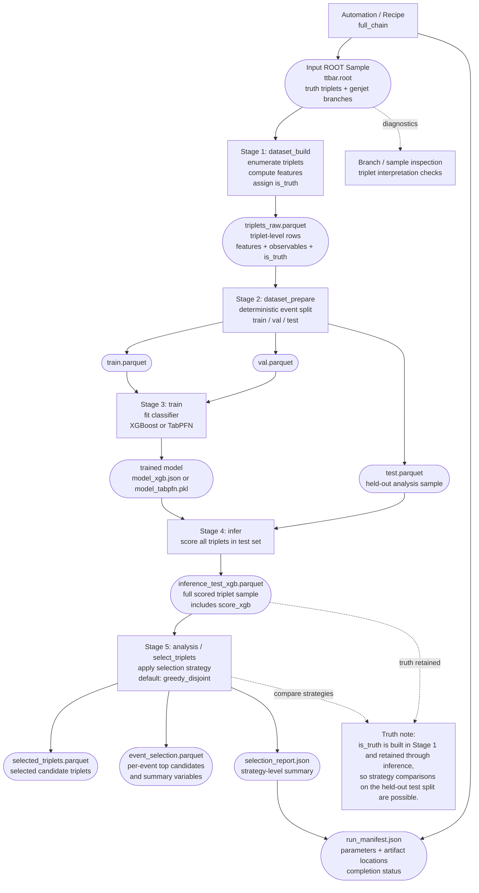

# Simple Workflow Chart

This is a compact workflow chart for the top reconstruction pipeline.

## Notes

- Rectangles represent processing stages.
- Rounded boxes represent stored artifacts.
- Dashed arrows represent auxiliary diagnostics or annotations.
- Analysis runs on the held-out test split, not on training events.